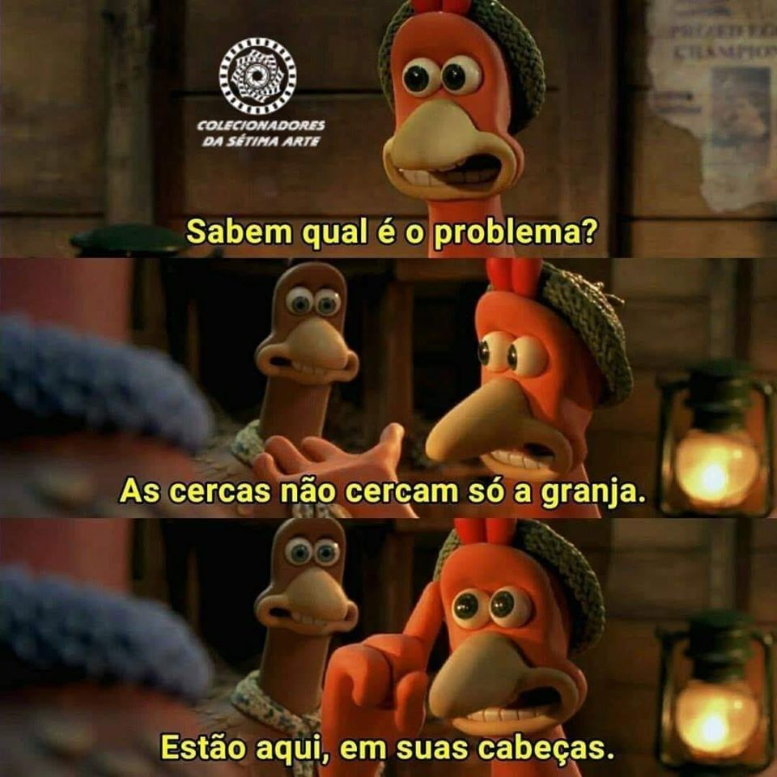

Street Pet
==========

**ATENÇÃO**
O projeto já está em desenvolvimento no link: https:/github.com/StreetPet, evite usar este repositório, ele é mantido por questões histórias e de referência aos que estão chegando.
{: .warning }

## Página Usuário Final

Temos duas páginas que se destinam aos usuários finais:

- PetFriendly -> http://bit.ly/streetpet_petfriendly
- StreetPet -> http://bit.ly/streetpet_web_app

## Objetivo e Apresentação

Um Sistema OpenHardware e OpenSource de Alimentação e tratamento de Cães e Gatos Abandonados, o **objetivo** é colecionar ideias e assim  **desenvolver um sistema que alimente e borrife remêdios** em cães e gatos catalogados e chipados que estejam em situação de abandono. O sistema também visa catalogar os Pets em situação de abandono, cadastrar ONGs e Cuidadores, e analisar o histórico de tais animais oferecendo dados para que sejam processados e analisados por especialistas no ramo de veterinária e zoonoses.

O Projeto pertence a todos nós, se você acredita que o projeto pode melhorar você é a pessoa que procuramos, assim você pode com seus conhecimentos nos ajudar a melhora-lo. [Visite este link e deixe sua colaboração](http://bit.ly/streetpet_sugestoes), você pode editar qualquer arquivo deste projeto e ampliar a documentação.

A ideia é que o projeto seja replicado e aplicado pelos participantes em sua região, usando as arquiteturas de software e hadware que melhor lhe atender, portanto foi criado uma [Organziação no GitHub chamada StreetPET](http://bit.ly/streetpet_org_oficial) para agregar todos as propostas conforme arquietura, desde que a API de comunicação seja padrão, permitindo total interoperabilidade.

A API e a distribuição oficial de APPs será centradano [Firebase da Google](http://bit.ly/streetpet_web_app), porém você pode ter seu próprio servidor usando outro hosting, basta você desenvolve-lo, mas deixo o convite para somar no nosso, assim teremos uma base mais sólida, e evitamos perda de dados já que para que cruzemos informações teremos que criar um mecanismo de interoperabilidade entre os servidores e isso só vai aumentar desnecessáriamente os custos de nosso projeto.

## Colaborando e Contribuindo

Antes de tudo é interessante que tome conhecimento de nosso [código de conduta](./codigodeconduta), Para colaborar com o projeto veja as instruções [clicando aqui](./CONTRIBUTING), em seguida [leia o que está sendo sugerido](http://bit.ly/streetpet_sugestoes), se familiarize com a interface do GitHub e então contribua com seu conhecimento. você pode também me contactar diretamente via e-mail (demoro a responder) ou via whatsapp (+55 85) 99125-7722.

[Clique aqui e veja a lista de voluntários](./voluntarios.md).

## Regulamento e Sugestões de comportamento

[Neste link, você pode encontrar o regulamento e sugestões de comportamento no projeto](./Regulamento.md)

## Mascote do Projeto

Veja a história da [Cachorrinha clicando aqui](http://carlosdelfino.eti.br/projetos/StreetPet/).

## Perguntas Frequentes sobre o Projeto

[Separei neste link algumas perguntas do projeto](./FAQ.md).

## Números do Projeto

[Anotações, estatísticas e conclusões](./numeros.md).

## Monetização do Projeto e com o Projeto

[Regras de monetização do nosso projeto](./monetizacao.md)

## Arquitetura do Sistema

* [API](./API.md)
* [Módulos](./modulos.md)

## Algumas Imagens e Videos do Projeto

Ainda é uma fase inicial e de planejamento não temos equipamentos ou softwares, porém já temos uma referencia de como será o comedouro e o bebedouro usado, já construído como exemplo por "Carlos Delfino", desta base será construído os controladores, o monitoramento e identificação e o borrifador, além do controle de dosagem de alimentação.
 

------------------------------------

 
<!-- google analytics -->

<!-- fim google analytics -->

<!-- sem google analytics -->

