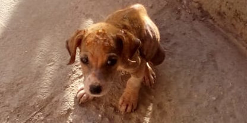

# StreetPet

Sistema OpenHardware e OpenSource de alimentação e tratamento de Cães e Gatos Abandonados, o objetivo é colecionar ideias e desenvolver um sistema que alimente e borrife remedios em cães e gatos catalogados e chipados que estejam em situação de abandono

A ideia é que o projeto seja replicado pelos participantes em sua região, usando as arquiteturas de software e hadware que melhor lhe atender, portanto foi criado uma [Organziação chamada StreetPET no GitHUB](http://bit.ly/streetpet_org) para agregar todos as propostas conforme arquietura, desde que a API de comunicação seja padrão, permitindo total interoperabilidade.

[Clique aqui para ver as Perguntas e Respostas sobre o Projeto.](./FAQ.md)

[Neste link apresento os módulos do Projeto](modulos.md)

## Mascote do Projeto

Veja a história da [Cachorrinha clicando aqui](http://carlosdelfino.eti.br/projetos/StreetPet/).

## Arquitetura do Sistema

* [API](./API.md)
